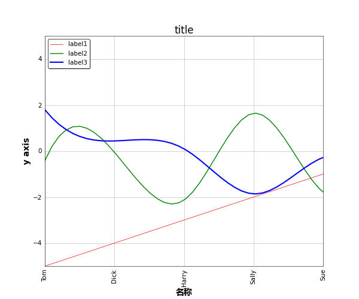

# Visualization Tools #

This repository is mainly about data visualization in scientific research based on python3. The details so far will be shown below.

## 2D Visualization ##

### Line Graph ###

Based on python module `matplotlib.pyplot`, customize parameters in `plot.py` to visualize a line graph. It  includes settings of axies, title, legend, lines and so on.

An example:

